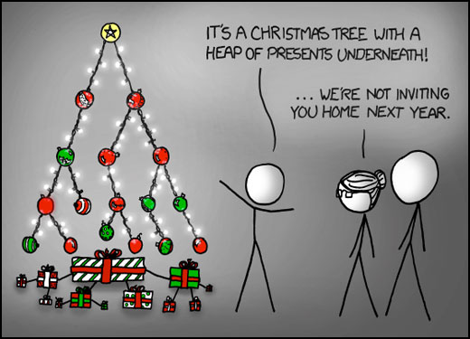

# COP 3530 - Data Structures and Algorithms I
# Project 4 - Library Tree

## Overview 
Tree based data structures generally offer the benefit of O(log2 n) operations. Basic operations on Binary Search Trees (and other similar trees) involve creation, search, insertions and deletions, and lookup. Inorder traversal can provide a basic sorting on a key in tree node data.
This project is meant to familiarize the students with creation of a tree based data structure for a specific application involving a library of books.
 
 
 
Cartoon from ikcd.com

## Project Outcomes 
The focus of this assignment is on the following learning objectives: 
* Be able to identify classes required from the problem description
* Be able to identify class functionality for a Binary Search Tree 
* Be able to identify an incremental approach to developing the program solution by adding capability to the Binary search tree class to application-specific classes

## Preparatory Readings

* Chapter 6 - Input and Output
* Chapter 13 - Node background
* Chapter 17 - Trees

## Problem Description
You are to implement a program for creating a library catalog that will read in and store file data as a Binary Search Tree based on a key. For this project, you will need to utilize the concepts of Binary Search Trees and the various tree operations that have been discussed in class. The list of requirements and constraints for the system are as follows:
### 1.	System Initialization 
  * First, the program will read text file **bookData.txt**. It is your responsibility to create class Book with fields for Title, Author, subject, publisher, and number of copies of the book. You can see these data in the file in this repo. YOur program must handle errors on input in the file. Note that class Book will take the place of the integer value in class Node.
  * As the program reads the data it will create a Binary Search Tree of book data from the file entries
### 2.	The User Interface
After building the library tree, your program will display the following menu:

```
================================================================
         Welcome to Your Neighborhood Library
================================================================ 
Select an option (1 - 7):
  1: Check if a book is in the library system
  2: Show the names of all the books in the library
  3: Show all the books with full details
  4: Check if a book is currently available
  5: Check out a book
  6: Return a book
  7: Exit the program
================================================================ 
Please enter your selection from the menu -> 
```

The menu items work as follows:
  * *Check if a book is in the library system:* If the book is not in the system, the program should indicate that. 
  * *Show the names of all the books in the library:* generate a list of book names only sorted order.
	```
		Artificial Intelligence
		Computer Networking
		Operating System Concepts
  	```
  * *Show all the books with full details:* generate a list of books with all details in alphabetically sorted order by book name:
  
	```
	Artificial Intelligence, by Stuart Russell
		Subject: AI & ML
		Publisher: Pearson Education
		1 Paperback copy available
	Computer Networking, by James Kurose
		Subject: Networking
		Publisher: Pearson Education
		2 Hardcover copies available
	Operating System Concepts, by Abraham Silberschatz
		Subject: OS
		Publisher: Wiley
		1 Kindle copy available
	```  
  * *Check if a book is currently available:* The user enters a full book name. This alternative should specify that the book is available, no copies are available, or the book is not in the library.
  * *Check out a book:* Request for a book loan by full book name. If the book is available, decrement number available. This is a forgiving library - we will NOT track the user who loaned the book!
  * *Return a book:* If the book is in the library, increment the count of books available
  * *Exit the program:* The program repeatedly displays the menu until this option is selected.

#### Input Format and Sample data
```
Book Title
Author
Subject
Book Format, e.g. Paperback, Kindle
Publisher
#copies available
Artificial Intelligence
Stuart Russell
AI & ML
Paperback
Pearson Education
5
Computer Organization
David A. Patterson
CompOrg
Paperback
Morgan Kaufmann
3
```

### Implementation Notes:
1. Create a project that is object oriented, therefore there should be several classes.
2. The input file will match the exact format given above.

### Testing
I encourage you to utilize a test-driven development approach to this project by building test cases and then coding to the cases. If you utilize this approach, you may receive up to 5 points of extra credit. You can optain a grade of 100% without doing this, but you can get up to 105% if you use a test-driven approach. I have included the catch testing framework and test.cpp in their usual places for this project.

### Submission Requirements:
1. All code must be added and committed to your local git repository.
2. All code must be pushed to the GitHub repository created when you "accepted" the assignment.
	1. After pushing, with `git push origin master`, visit the web URL of your repository to verify that your code is there.
	If you don't see the code there, then we can't see it either.
3. Turn in a zipped version of your project to Canvas by the program deadline.

## Important Notes:
* Projects will be graded on whether they correctly solve the problem, and whether they adhere to good programming practices.
* Projects must be received by the time specified on the due date. Projects received after that time will get a grade of zero.
* Please review the academic honesty policy.
	* Note that viewing another student's solution, whether in whole or in part, is considered academic dishonesty.
	* Also note that submitting code obtained through the Internet or other sources, whether in whole or in part, is considered academic dishonesty.
	* All programs submitted will be reviewed for evidence of academic dishonesty, and all violations will be handled accordingl
  

